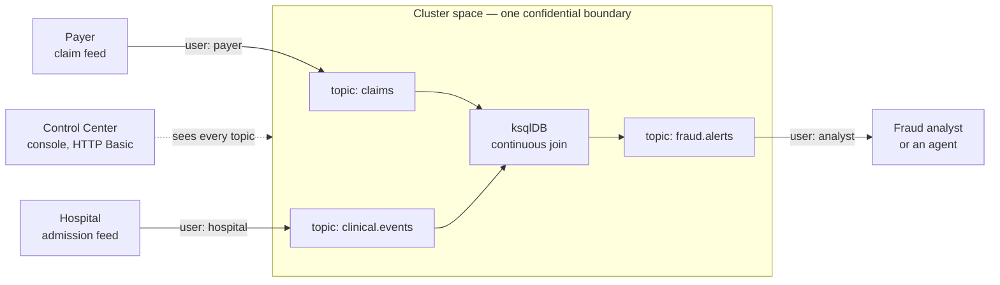
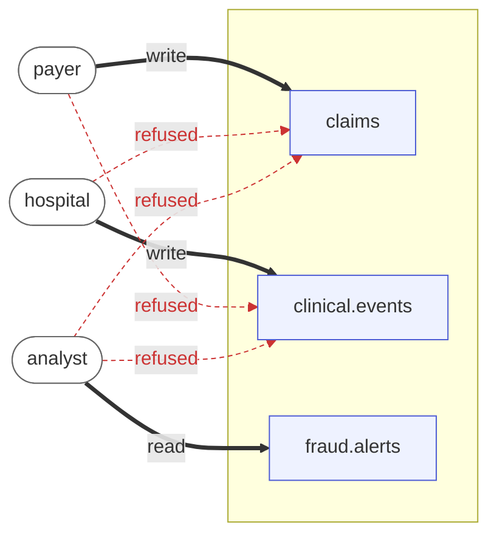
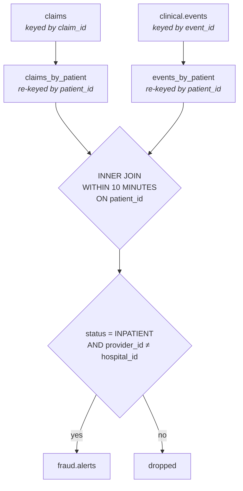
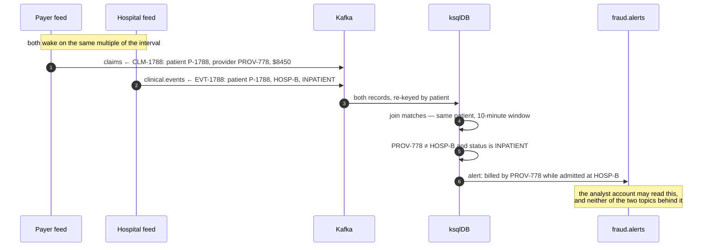
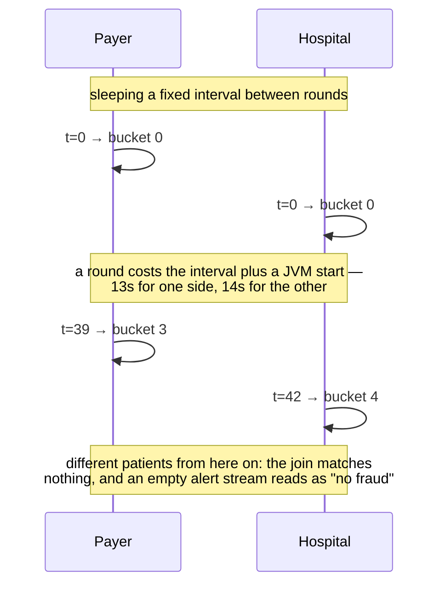

# claims-fraud-feed

The two parties of the **Confidential Claims Fraud Detection** demonstration: a payer publishing
claims and a hospital publishing admissions, as two workloads with two separate credentials.

This chart is one half of the listing. The other half is
[`confluent-platform`](../confluent-platform) — the bus, the stream processing and the console —
and the two are composed by [`apps/confidential-claims-fraud`](../../apps/confidential-claims-fraud),
which is also where the scenario is argued rather than described.

---

## What the whole thing demonstrates

A payer and a hospital both hold half of a fraud signal and neither can see the other's half. Pooling
the two is the obvious answer, and the reason it is rarely done is not technical: **whoever holds the
pool reads everyone's stream.**

So the demonstration is not "a fraud rule runs". It is:

1. Two organisations publish into **one bus that neither of them operates**.
2. Neither can read — or write — the other's topic, and that is enforced by the broker rather than
   promised in a diagram.
3. A continuous query joins both streams and emits only the contradictions.
4. The operator of the bus cannot read any of it either, because the whole space runs inside a
   confidential boundary and publishes signed evidence of what it is running.

Point 4 is what makes points 1–3 possible outside a single company. Everything else is ordinary
Confluent, which is deliberate: the argument is that confidentiality makes an existing architecture
*deployable between parties*, not that it replaces it.

---

## How it fits together



Everything inside the box is one deployment in one namespace. The parties are drawn outside it
because that is what they represent — in this demonstration they run inside it too, since the point
being made is about who can *read* what, not about network topology.

---

## Who may touch what

The broker authenticates every connection with SASL/PLAIN and authorises every operation with the
KRaft `StandardAuthorizer`. Accounts get exactly what they declare and nothing by default:



Solid is granted, red dashed is what the broker refuses with `TOPIC_AUTHORIZATION_FAILED`.

| Account | Granted | Denied |
|---|---|---|
| `payer` | write `claims` | reading anything, and `clinical.events` entirely |
| `hospital` | write `clinical.events` | reading anything, and `claims` entirely |
| `analyst` | read `fraud.alerts`, join group `fraud-analyst` | the claims and clinical events an alert was derived from |
| `admin` | superuser | — it is what ksqlDB and Control Center run as |

The analyst row is the interesting one: **the conclusion is shareable without the evidence behind it
being shareable.** That is the shape most cross-organisation analytics actually needs.

---

## What the rule is

Deliberately something a person can check — no model, no threshold, no score:

> a claim naming a provider, while the clinical record has that patient admitted somewhere else,
> inside the same ten minutes.



The re-keying step is not decoration. A stream-stream join in Kafka is a join of **co-partitioned**
topics, and each party keys its own events by its own identifiers — a claim by claim id, an
admission by event id. Neither is keyed by the patient, so neither can be joined until it is.

Because the rule is legible, what the confidential deployment protects is visibly *the data and the
join* — not a secret algorithm whose value has to be taken on trust.

---

## One claim, end to end



A clean pair — the payer billing as the same site the patient is admitted to — travels the same path
and is dropped at the `WHERE`. With the defaults, one claim in four conflicts.

---

## What this chart actually deploys

Four objects, and nothing that talks to anything but the broker:

| Object | Purpose |
|---|---|
| `Deployment …-payer` | the claim feed |
| `Deployment …-hospital` | the admission feed |
| `Secret …-clients` | one client-properties file per party — sealed for the target, never in a manifest |
| `ConfigMap …-scripts` | the two feed scripts |

Both feeds run the stock `confluentinc/cp-server` image and a shell script. There is no image to
build for this demonstration, which is why it can be raised from the marketplace with nothing behind
it but the catalogue.

### Values

| Key | Default | Meaning |
|---|---|---|
| `bootstrapServers` | — | the broker, as `<release>-kafka:9092` |
| `payer.username` / `payer.password` | `payer` / — | the identity the claim feed authenticates as |
| `payer.topic` | `claims` | where it writes |
| `payer.providerId` | `HOSP-B` | the provider it bills as when *not* producing a conflict |
| `hospital.username` / `hospital.password` | `hospital` / — | the identity the admission feed authenticates as |
| `hospital.topic` | `clinical.events` | where it writes |
| `hospital.hospitalId` | `HOSP-B` | the site the patient is admitted to |
| `intervalSeconds` | `10` | one pair per interval |
| `conflictEvery` | `4` | every Nth pair contradicts |
| `image` | `confluentinc/cp-server:8.3.1` | pinned by digest at the listing level |

Passwords are supplied by the marketplace as sealed parameters; the chart never carries one.

---

## Why the feeds watch the clock

They must name the same patient without talking to each other — a coordination channel between two
parties who are supposed to be strangers would undo the point of the demonstration. So both derive
the patient id from the wall clock:

```
bucket  = now / intervalSeconds
patient = P-<bucket>
```

and only the payer decides whether that round conflicts.

The subtlety is *when* each reads the clock. Every round spends a few seconds starting a JVM to send
a single message, so feeds that simply slept between rounds drifted apart within a minute:



Both now sleep to the next multiple of the interval **before** deriving the bucket, so the value is
read at the same wall-clock instant on both sides regardless of how long the send takes.

This mattered more than it looks: a join that never matches is indistinguishable, from the outside,
from a rule that correctly found nothing. The topics fill, the console looks healthy, and the alert
stream stays empty — which reads as "no fraud today" rather than "broken".

---

## Running the demonstration

Deploy `confidential-claims-fraud` from the marketplace, take the offered hostname, and give it a
few minutes: the broker formats its storage, a job creates the topics and grants, ksqlDB starts, and
only then are the queries submitted.

In Control Center:

1. **Topics** → `claims` and `clinical.events` filling from two different identities; `fraud.alerts`
   holding only the contradictions.
2. **Any topic → Messages** → the actual records, which is also the honest way to make the
   confidentiality point: this is what the operator of an ordinary bus can read at will.
3. **ksqlDB** → the join, running continuously rather than on a button.

### Signing in

The browser is challenged at the **Ingress**, before the console's own code runs, and the
credentials it collects are forwarded to Control Center — so one prompt covers the whole session and
`admin` and `viewer` still get their different rights inside the console.

That indirection exists for a reason. Control Center protects only its API: the page itself is
served to anyone, so the first prompt used to arrive from a request the loaded application made,
which the browser answers less reliably — the console polls, every refused poll asks again, and the
password typed into one of those prompts does not reach the rest.

### Showing the refusal

This is the part that proves the grants are load-bearing, and it is also the part the console cannot
do for you: Control Center connects as the superuser, so it can never demonstrate being refused.

It needs a client of your own. The broker is reachable only from inside the cluster space, and the
`analyst` credential is in the deployment's outputs, so with `kubectl` access to the space:

```bash
# in a pod in the namespace, with the analyst credential in client.properties
kafka-console-consumer --bootstrap-server <release>-kafka:9092 \
  --command-config client.properties --topic clinical.events --from-beginning
# → TopicAuthorizationException: Not authorized to access topics: [clinical.events]
```

Note that a **published** space refuses `exec`, so this means unpublishing first — and unpublishing
takes the hostname out of service until it is published again. Making the refusal visible from the
console alone is a follow-up, not something this listing does today.

---

## Limits worth stating before a demo

- **The wire inside the cluster space is not separately encrypted.** SASL here provides *identity*,
  which is what the ACLs are written against; confidentiality comes from the space itself. TLS
  between two pods of one attested deployment would defend against an attacker already inside the
  boundary.
- **The alert stream is where a decision would go, not a decision.** Wiring an agent onto
  `fraud.alerts` — reading it with the `analyst` credential and asking a confidential model what to
  do — is the next component, not part of this one.
- **The data is synthetic and repetitive by construction.** It exists to make the mechanism visible,
  not to resemble real claims traffic.
- **One broker.** That is what Confluent's developer licence covers, indefinitely and with every
  commercial feature; adding a second starts a 30-day trial that cannot be reverted.
